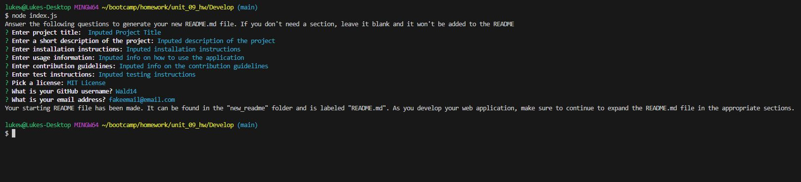

# README Generator

## Description
This is application allows the user can quickly and easily create a README file for a new project.

When using the command-line, the user is prompted for information about their application repository. This includes the project title, short description, installation info, usage info, license info, contribution info, tests info, and the user's email/github for a questions section.

A high-quality README is then generated that includes the corresponding sections, along with a Table of Contents and a license badge. If any of the sections are left blank, that section will NOT be added to the README file. If no sections are added, no Table of Contents will be generated.

## Table of Contents
- [Installation](#installation)
- [Usage](#usage)
- [Questions](#questions)
- [Acknowledgements](#acknowledgements)
- [Preview](#preview)

  
## Installation
1) Download repository
2) Run 'npm init' in command prompt after downloading

## Usage
Run 'node index.js' in the command line. Answer all prompts. Then navigate to the 'new_readme' folder to find your newly generated README.md file.

## Questions
- Questions can be received on the [Github Repository](https://github.com/Wald14) for this application. Please open a new issue.

## Acknowledgements
- Gary Almes (Professor)
- [W3School](https://www.w3schools.com/)
- [MDN Web Docs](https://developer.mozilla.org/)
- [Stack Overflow](https://stackoverflow.com)

## Preview
The following images share the application's apperance:

